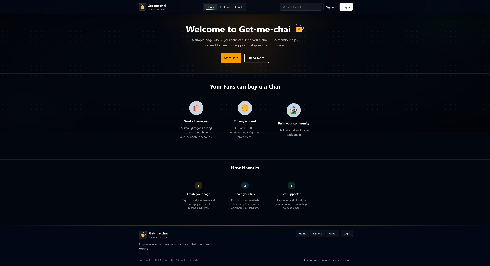
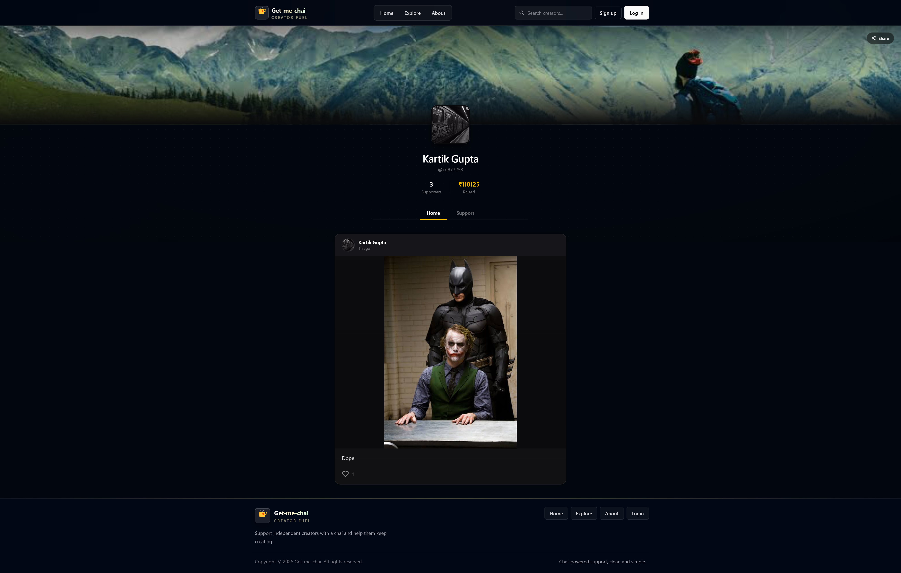
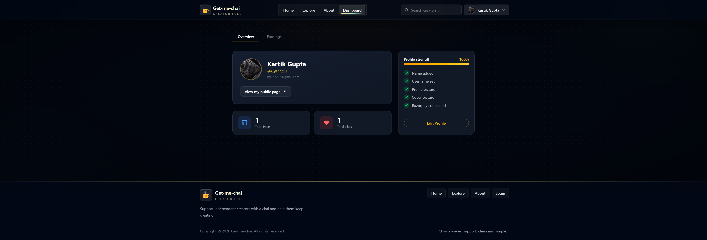
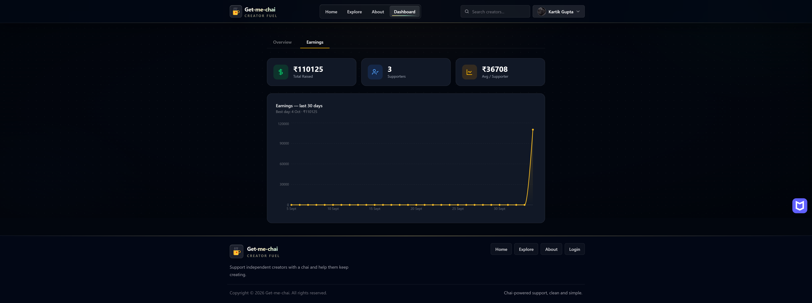
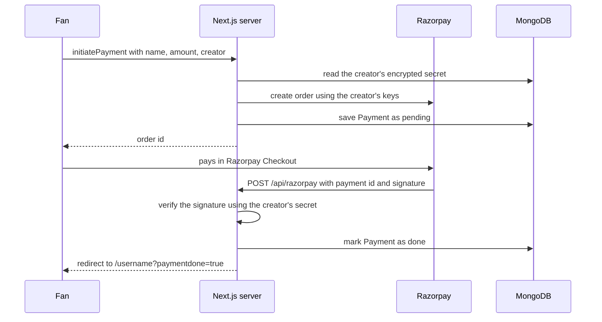

# Get-me-chai

A creator support platform where fans can send a creator a chai without making an account. The money goes straight to the creator's own Razorpay account, not through me.

**Live:** https://get-me-chai-self.vercel.app

I built this as my first full project while learning Next.js. It started from the Sigma Web Development course, and it is inspired by Patreon and Buy Me a Coffee, but most of what is in here (per-creator payments, explore page, earnings dashboard, encrypted keys) I added on my own.

    

## Screenshots

| Home | Creator page |
| --- | --- |
|  |  |

| Dashboard | Earnings |
| --- | --- |
|  |  |

## What it does

**For fans**
- Open any creator's page at `/username` and support them with just a name, an amount and an optional message. No login needed.
- Log in with Google or GitHub if you want to like posts. A logged in fan gets a `/me` page with the creators they liked.
- Find creators from the search bar in the navbar, or browse everyone on `/explore` (sorted by total raised).

**For creators**
- Sign up as a creator, fill in a profile and add your own Razorpay keys.
- Post a caption with an image, and see how many likes each post got.
- Dashboard with total raised, number of supporters, average per supporter, post stats, a profile completeness checklist and a graph of the last 30 days.
- Edit your profile from a slide-in drawer without leaving the dashboard.

## Try it

The site runs in **Razorpay test mode**, so no real money is used at all.

1. Go to [/explore](https://get-me-chai-self.vercel.app/explore) and open any creator.
2. Enter a name and an amount (₹1 to ₹1,00,000) and click pay.
3. In the Razorpay popup choose UPI and enter `success@razorpay`. Use `failure@razorpay` if you want to see a failed payment.
4. For cards, Razorpay has a list of test card numbers: [razorpay.com/docs/payments/payments/test-card-details](https://razorpay.com/docs/payments/payments/test-card-details/)

After a successful payment you come back to the creator's page and your name shows up in the supporters list.

## How a payment works

Every creator saves their own Razorpay key ID and secret, and the server uses those keys to create the order. That is why the money lands in the creator's account directly.



A payment only shows up in the supporters list after the signature is verified on the server. The client is never trusted for that.

## Things I did on purpose

- **Guest payments.** A fan should not need an account to give someone ₹50. Login is only for liking posts.
- **Per-creator Razorpay keys, encrypted.** The secret is encrypted with AES-256-GCM (`lib/crypto.js`) before it is saved, and it is never sent back to the browser. If you lose the `ENCRYPTION_KEY`, saved secrets cannot be read again.
- **Server actions with checks inside them.** Things like deleting a post, reading earnings or editing a profile check the logged in user on the server. Hiding a button in the UI is not treated as security. Public actions also check that their inputs are strings.
- **Username rules.** Usernames are unique ignoring upper and lower case, and names like `dashboard` or `explore` are reserved because they are real routes.
- **Signup and login are separate.** Trying to log in without an account does not silently create one.

## Project structure

```
actions/useraction.js     all server actions (payments, profile, posts, likes, stats)
app/
  [username]/             public creator page
  api/auth/[...nextauth]/ NextAuth route
  api/razorpay/           payment callback and signature check
  dashboard/  explore/  me/  login/  signup/  about/
components/               Navbar, Dashboard, Paymentpage, Postfeed, Postmanager, ...
db/connect.js             MongoDB connection
lib/authOptions.js        NextAuth config (signup, login, roles, session)
lib/crypto.js             encrypt and decrypt Razorpay secrets
models/                   user, payment, posts, like
```

## Run it on your computer

You need Node.js, a MongoDB database (Atlas free tier is fine), Google and GitHub OAuth apps, and a Razorpay account in test mode.

```bash
git clone https://github.com/kg877253/Get-me-chai.git
cd Get-me-chai
npm install
```

Make a file called `.env.local` in the main folder:

```env
MONGODB_URI=
NEXTAUTH_URL=http://localhost:3000
NEXTAUTH_SECRET=
GOOGLE_CLIENT_ID=
GOOGLE_CLIENT_SECRET=
GITHUB_ID=
GITHUB_SECRET=
NEXT_PUBLIC_BASE_URL=http://localhost:3000
ENCRYPTION_KEY=
```

| Name | What to put |
| --- | --- |
| `MONGODB_URI` | MongoDB connection string. Put the database name in it, like `.../getmechai?retryWrites=true&w=majority` |
| `NEXTAUTH_URL` | Your site link, `http://localhost:3000` on your computer |
| `NEXTAUTH_SECRET` | Any long random string |
| `GOOGLE_CLIENT_ID`, `GOOGLE_CLIENT_SECRET` | From Google Cloud Console |
| `GITHUB_ID`, `GITHUB_SECRET` | From GitHub developer settings |
| `NEXT_PUBLIC_BASE_URL` | Your site link again. It is used after a payment, so it must match the real site |
| `ENCRYPTION_KEY` | 64 character hex key used to encrypt Razorpay secrets |

You can generate a key for `ENCRYPTION_KEY` (and a string for `NEXTAUTH_SECRET`) with:

```bash
node -e "console.log(require('crypto').randomBytes(32).toString('hex'))"
```

OAuth callback URLs to add in the Google and GitHub consoles:

```
http://localhost:3000/api/auth/callback/google
http://localhost:3000/api/auth/callback/github
```

Then start it:

```bash
npm run dev
```

Open http://localhost:3000. Don't push `.env.local` to GitHub, and use Razorpay **test mode** keys while developing.


## Built by

Kartik Gupta, B.Sc. student at Delhi University.
[GitHub](https://github.com/kg877253) · [LinkedIn](https://www.linkedin.com/in/kartikgupta8)